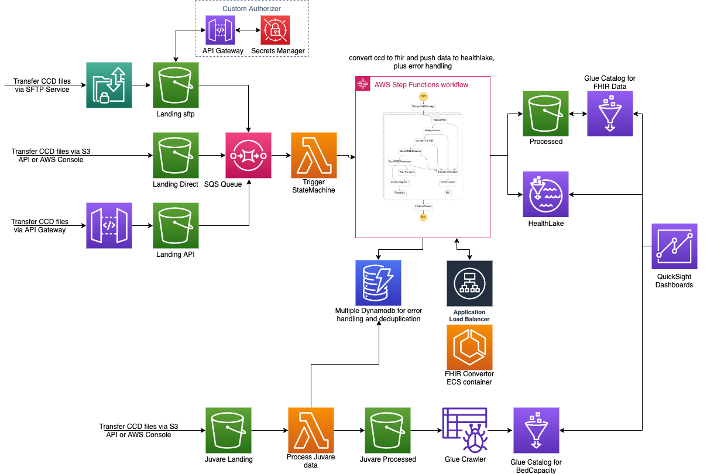
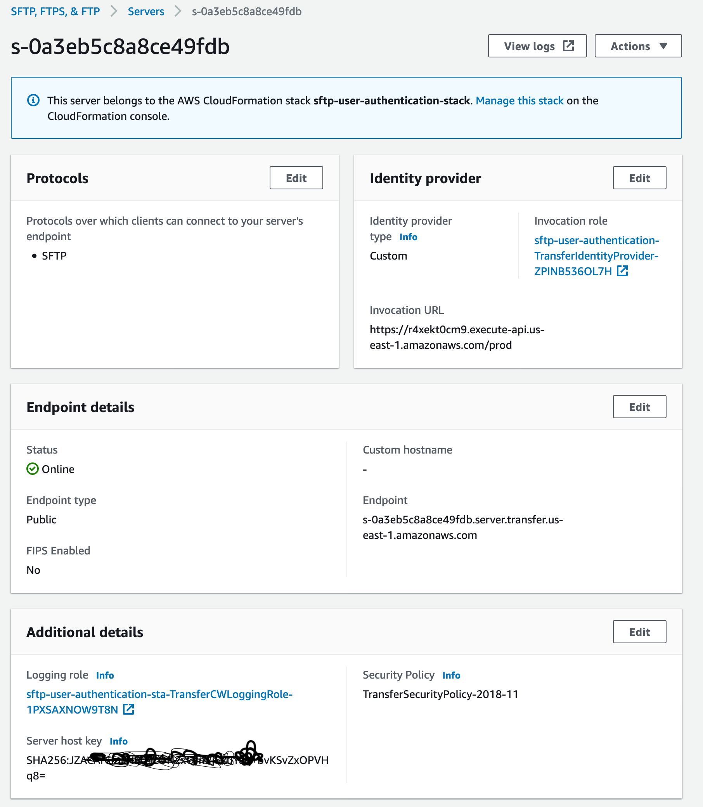

# Application Stack Deployment Instructions

The Application stack is divided into 5 different stacks and will be deployed in the following order

1. **Infra Stack:** Deploys VPC with 2 public and 2 private subnets
2. **FhirConvertor Stack:** Deploys fhir convertor container image on AWS ECS on Fargate with an Application Load Balancer as frontend. Dependent on (1)
3. **Fhir Stack:** Deploys s3 buckets, kms keys, lambda jobs, step functions to process and convert ccd, hl7 files into Fhir format and push them into HealthLake. Denpendent on (1)(2)
4. **Juvare Stack:** Deploys s3 buckets, kms keys, lambda jobs, glue crawlers to process the juvare files. Does not depend on any stack.
5. **SFTP Stack:** Deploys sftp server with custom authentication via API Gateway and Secrets Manager. SFTP users have to be created manually in Secrets Manager as per process described below.



##  Pre-requisites
1. Administrative privileges on Target Account
2. HealthLake must be enabled on Target Account. Since Healthlake is still in preview mode, special permissions must be obtained before it can be manually enabled in the account. Getting this permission may take 2 weeks. The above stack can be implemented without Healthlake, however ccd and hl7 files will not be processed and step functions will run into error state. However, Juvare is independent of Healthlake. (as of Jan 2021)

## Installation Steps via CodeBuild
In Target Account:
1. Deploy Cloudformation template "cloudformation/crossaccount-iamroles.yaml" in the Target Account. This creates an Admin privileged role with required permissions in the target account which can be assumed by the codebuild service role from the Central Tools Account.

In Tools Account:

2. Deploy Cloudformation template "cloudformation/create-new-env-codebuild.yaml". This will create a codebuild project which is an automated method to deploy all the required stacks in the target account. The codebuild project can also be triggered to push any updates to the target environment.
3. Open Codebuild console, select the newly created codebuild project and click StartBuild. Follow the logs to ensure there are no errors during the deployment. This codebuild project will deploy all the required stacks mentioned above in the respective order in the target environment.

## Alternate Installation procedure
1. If you have access to a cli environment with AWS Admin level privileges
Verify your session is set to use correct AWS profile/credentials
```shell script
aws sts get-caller-identity
```

Assuming nodejs and npm is already installed

Clone this repo
```shell script
npm install -g aws-cdk
npm install -g typescript
npm install
cdk bootstrap
cdk synth
# uses default context variables envName="dev", vpcCidr="10.0.0.0/16", healthLakeEndpoint="UNDEFINED"
cdk deploy --all 
# with specific context variables example, not a valid healthlake endpoint
cdk deploy -all --context envName="prd" --context vpcCidr="10.108.0.0/22" --context healthLakeEndpoint="https://healthlake.us-east-1.amazonaws.com/datastore/xxxxxxxxx/r4/"
# Optional to deploy the sftp stack with custom auth
cd sam
CDK_BOOTSTRAP_BUCKET=$(aws s3 ls |grep cdktoolkit|head -1| awk '{print $NF}')
sam build
sam deploy --no-confirm-changeset --s3-bucket ${CDK_BOOTSTRAP_BUCKET} --s3-prefix sam-sftp
```

To destroy the stacks

```shell script
cdk destroy --all 
```


### FinalSteps
Once the codebuild project is finished, goto the target account and perform the final steps.

- Create users for sftp as per instructions below.
- Push Juvare data to the Juvare landing S3 buckets
- Enable QuickSight and create dashboards

### SFTP User creation

1. Once the SFTP server is deployed as per above instructions. Note the sftp server-id.
2. SFTP User configuration is maintained in AWS Secrets Manager. Login to AWS Console, Goto AWS Secrets Manager.
3. To create a user, select "Store a new secret", select "Other type of secrets" and add the three required parameters
- **Password**          - A complex and unique password
- **Role**              - arn:aws:iam::{accountid}:role/{env}-rush-sftp-user-role eg: ```arn:aws:iam::199592724270:role/dev-rush-sftp-user-role```. This role will be used by the sftp service to drop the file in target bucket on behalf of the user. SFTP role is already created by the terraform deployment with all required permissions.
- **HomeDirectory**     - /{sftp_bucket_name}/{sftpusername}. eg: ```   /dev-rush-landing-sftp/sftpuser```


Select Next, provide a name for the secret. Secret name must match exactly {sftp server id}/{sftpusername}. eg: ```s-0a3eb5c8a8ce49fdb/sftpuser```


Select Next and Save the secret.

You should now be able to login with sftpusername and password stored in secret.

The sftp endpoint can be obtained from the SFTP server parameters.


