# Bed Capacity Setup

- [Juvare - Bed Capacity Setup](#juvare---bed-capacity-setup)
  - [Architecture](#architecture)
  - [Uploading Juvare Data](#uploading-juvare-data)
  - [Lambdas](#lambdas)
      - [What are Lambdas?](#what-are-lambdas)
      - [Daily Have Bed](#daily-have-bed)
      - [CDPH IDPH](#cdph-idph)
  - [DynamoDB Tables](#dynamodb-tables)
      - [What is DynamoDB?](#what-is-dynamodb)
      - [Table - Juvare Executions Logs](#table---juvare-executions-logs)
      - [Table - Juvare Hash Logs](#table---juvare-hash-logs)
  - [Glue](#glue)
    - [Glue Data Catalog](#glue-data-catalog)
    - [Glue Tables](#glue-tables)
    - [Glue Crawlers](#glue-crawlers)
      - [How Crawlers work](#how-crawlers-work)
  - [Athena](#athena)
      - [What is Athena and how it works:](#what-is-athena-and-how-it-works)
      - [Checking data using Athena](#checking-data-using-athena)
  - [Quicksight Setup](#quicksight-setup)

## Architecture

Bed Capacity dataflow architecture:

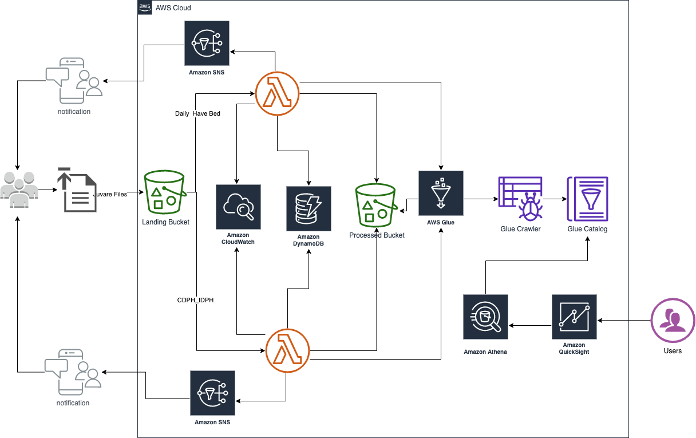

1. Juvare data is uploaded to the Landing Bucket
2. When a new file is created inside any folder in this bucket a specifc Lambda Function executes. The Lambda will split each sheet into a new folder at the Processed Bucket.
3. If an error occurr, like a file is Duplicated, it will raise an exception. The exection will be saved into Dynamodb logs table, and a SNS message will be sent to the SNS Topic
   Any other exceptions will be logged both to the Execution Log in Dynamodb and CloudWatch.
4. After the data is processed into different folders representing each sheet into the Excel file, Lambda triggers a Glue Crawler to run and get the new data parition and changes to the schema.
5. With the data crawled and saved into Glue Catalog, the data can be used bu other services like Athena.
6. From the Athena connector in Quicksight, the data can be manipulated and visual reports and dashboards can be generated.

## Uploading Juvare Data

To start the DataFlow, Juvare files need to be uploaded to the correct folder in the Juvare landing bucket in S3

For Daily Have Bed files use the folder:
/daily-havbed

For CDPH_IDPH data use the folder:
/cdph_idph

Below is an example of the Bucket name and structure:

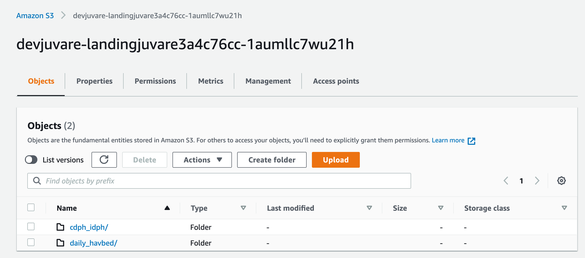

After the files are uploaded, to the respective folder, the specific Lambda is triggered and the process of split the Excel sheets into multiple folders into the Processed Juvare bucket in S3 starts.

**The file from the Landing Bucket is moved to the Processed Bucket respective folder, so the landing Bucket should always be empty**

If the Landing bucket contains file, check Dynamodb and Cloudwatch to verify what happen to the process.

To visualize the event trigger notifications from the Bucket, click on the tab Properties, and look for Event Notification.
Below is an example of the Trigger configuration at the Landing Bucket:

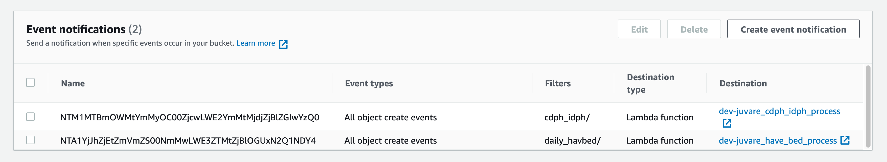

From the box above, we can see that an event type Lambda function will be triggered every time a object is created into the following folders:

- cdph_idph/
- daily_havbed/

The Lambda exectuded for each folder are different, as we will check on the next topic [Lambdas](#lambdas).

## Lambdas

#### What are Lambdas?

AWS Lambda is a serverless compute service that lets you run code without provisioning or managing servers, creating workload-aware cluster scaling logic, maintaining event integrations, or managing runtimes. With Lambda, you can run code for virtually any type of application or backend service - all with zero administration.
For more information refer to the [developer guide located here](https://docs.aws.amazon.com/lambda/latest/dg/welcome.html)

In our case, we used Python version 3.8.5 to create the Lambdas in this project.

#### Daily Have Bed

This Lambda is reponsible to split the sheets from the Daily Have Bed file into multiple folders, each with their respective CSV file.

Enviroment variables needed:

| Enviroment Variable            | Description                                                 |
| ------------------------------ | ----------------------------------------------------------- |
| BUCKET_PROCESSED_JUVARE        | Bucket where the processed data is saved                    |
| BUCKET_PROCESSED_JUVARE_FOLDER | Folder in the Bucket where the processed data is saved      |
| BUCKET_RAW_JUVARE_FOLDER       | Bucket where the RAW data is uploaded in the Landing Bucket |
| DYNAMODB_JUVARE_EXECUTION_LOG  | Dynamodb table to save the execution logs                   |
| DYNAMODB_JUVARE_HASH_TABLE_LOG | Dynamodb table to save the MD5 hash logs                    |
| GLUE_CRAWLER_JUVARE_HAVE_BED   | Glue Crawler for the Processed data                         |
| SNS_TOPIC_ARN                  | SNS Topic ARN                                               |

For this Lambda to work, some constrains need to be followed in each source file.
Let's take the example file provided:
**2020-12-04 1100 Update 1\_ Daily HAvBED Query Event Snapshot.xlsx**

1. Name of the file need to contains the date of the file as provided above, YYYY-MM-DD, as the first part of the Name
2. The Names of the Sheets in the Excell, can be different, but to have the data aggregated into the same dimensions later, we need to use the same names as below:
   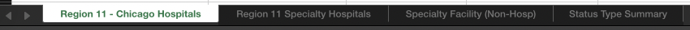
3. If you try to upload the same file more than once(with the same content), the file will be marked as duplicate and Exception is raised.

#### CDPH IDPH

This Lambda is reponsible to split the sheets from the CDPH IDPH file into multiple folders, each with their respective CSV file.

Enviroment variables needed:

| Enviroment Variable            | Description                                                 |
| ------------------------------ | ----------------------------------------------------------- |
| BUCKET_PROCESSED_JUVARE        | Bucket where the processed data is saved                    |
| BUCKET_PROCESSED_JUVARE_FOLDER | Folder in the Bucket where the processed data is saved      |
| BUCKET_RAW_JUVARE_FOLDER       | Bucket where the RAW data is uploaded in the Landing Bucket |
| DYNAMODB_JUVARE_EXECUTION_LOG  | Dynamodb table to save the execution logs                   |
| DYNAMODB_JUVARE_HASH_TABLE_LOG | Dynamodb table to save the MD5 hash logs                    |
| GLUE_CRAWLER_JUVARE_HAVE_BED   | Glue Crawler for the Processed data                         |
| SNS_TOPIC_ARN                  | SNS Topic ARN                                               |

For this Lambda to work, some constrains need to be followed in each source file.
Let's take the example file provided:
**2020-12-04 1100 Update 2\_ CDPH_IDPH Statewide COVID-19 Query Event Snapshot.xlsx**

1. Name of the file need to contains the date of the file as provided above, YYYY-MM-DD, as the first part of the Name
2. The Names of the Sheets in the Excel, can be different, but to have the data aggregated into the same dimensions later, we need to use the same names as below:
   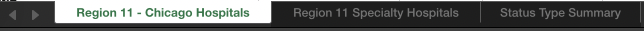
3. If you try to upload the same file more than once(with the same content), the file will be marked as duplicate and Exception is raised.

## DynamoDB Tables

#### What is DynamoDB?

Amazon DynamoDB is a key-value and document database that delivers single-digit millisecond performance at any scale. It's a fully managed, multi-region, multi-active, durable database with built-in security, backup and restore, and in-memory caching for internet-scale applications. DynamoDB can handle more than 10 trillion requests per day and can support peaks of more than 20 million requests per second.
For more information [click here to visit the Developer Guide](https://docs.aws.amazon.com/amazondynamodb/latest/developerguide/Introduction.html).

To get into Dynamodb console, go to Services > Dynamodb.
At the right menu click, Tables.
A List of tables will show, as the example below:

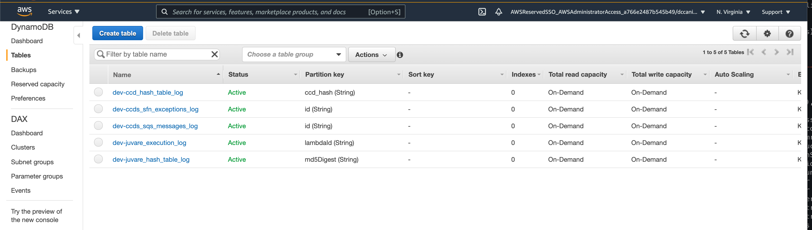

For Juvare specifc dataflow, there will be 2 tables that we need to cover:

1. juvare_execution_log
2. juvare_hash_table_log

#### Table - Juvare Executions Logs

The Execution Log tables, hold the status of each Lambda execution for each file processed into the Juvare DataFlow.
To simply querie this table click on the Table name and click on the Items Tab when the pages load, as showed below:
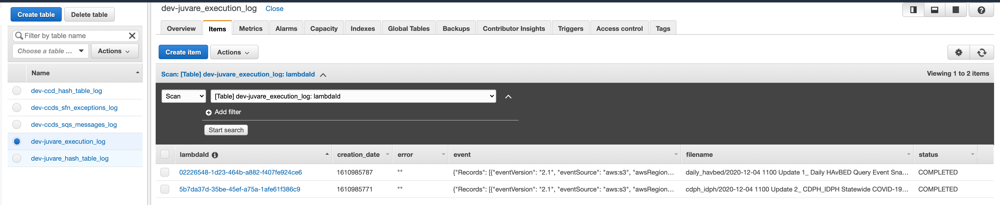

If there is files already processed in your platform, some items will show up containing the following:

| Field         | Description                                                        |
| ------------- | ------------------------------------------------------------------ |
| lambdaId      | Is the Partition key, unique id generated by each Lambda Execution |
| creation_date | Timestamp from the execution                                       |
| error         | If and Exception is raised, this is the error message              |
| event         | Full event input into the Lambda Execution                         |
| filename      | Name of the file been processed                                    |
| status        | IN_PROGRESS or COMPLETED                                           |

#### Table - Juvare Hash Logs

The Hash table log, hold each file MD5 digest, from the file content.
If any new file is uploaded with the same content as other file, the MD5 digest from that file will be matched with a MD5 that is already in the table, and the file will be consider duplicated.
The status of the File will remain IN_PROGRESS, so it can be reprocessed when fixed.
The below image is an example of how the hashs are storage:

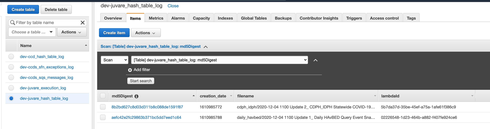

| Field         | Description                                                       |
| ------------- | ----------------------------------------------------------------- |
| md5Digest     | Is the Partition key, unique id generated by the file content MD5 |
| creation_date | Timestamp from the execution                                      |
| filename      | Name of the file been processed                                   |
| lambdaId      | unique id generated by each Lambda Execution                      |

## Glue

AWS Glue is a fully managed ETL (extract, transform, and load) service that makes it simple and cost-effective to categorize your data, clean it, enrich it, and move it reliably between various data stores and data streams.

You can use AWS Glue to organize, cleanse, validate, and format data for storage in a data warehouse or data lake. You can transform and move AWS Cloud data into your data store. You can also load data from disparate static or streaming data sources into your data warehouse or data lake for regular reporting and analysis. By storing data in a data warehouse or data lake, you integrate information from different parts of your business and provide a common source of data for decision making.

For more information please [visit the Developer Guide for Glue](https://docs.aws.amazon.com/glue/latest/dg/what-is-glue.html)

### Glue Data Catalog

The AWS Glue Data Catalog contains references to data that is used as sources and targets of your extract, transform, and load (ETL) jobs in AWS Glue. To create your data warehouse or data lake, you must catalog this data. The AWS Glue Data Catalog is an index to the location, schema, and runtime metrics of your data. You use the information in the Data Catalog to create and monitor your ETL jobs.

In our case, our Glue Catalog is automaticatly created from the CDK, we don't need to create one. To visit the Glue Catalog go to Services > AWS Glue:

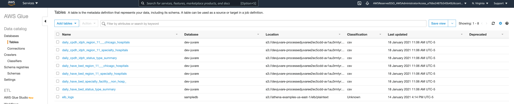

### Glue Tables

On this page, if there is data already uploaded into your platform, there will be a couple of tables, each table for an specifc Sheet from the Excel files uploaded before.

Each table has a specifc prefix so it's easy to locate from where that table is been created, for example:

- daily*cpdh_idph*\*: Reprents tables that are generated from the CPDH_IDPH files uploaded to the respective folder to be processed
- daily*have_bed*\*: Reprents tables that are generated from the HavBed files uploaded to the respective folder to be processed

If you click on one of the tables you can see the schema of that table specifically, for example, let's click on: daily_have_bed_region_11\_\_\_chicago_hospitals table.

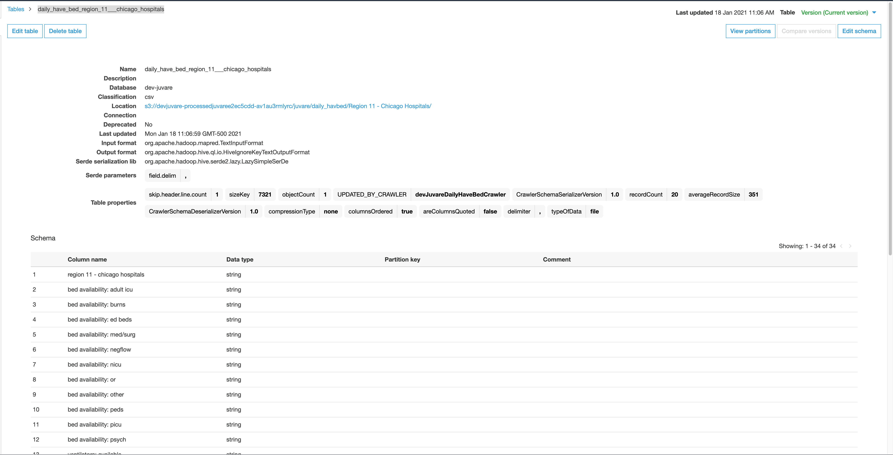

After the metadata information in the middle section of the page, you can find each column from the file imported into the Data Lake, this schema is partitioned bay Year, month, day, as you can find in the bottom of the schema table:

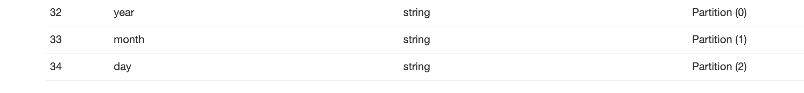

This will give your platform much more performance and a easy way to execute queries based on that columns.

At the very top right, you can find Version (Current Version), which means we are visualizing the current version of the table, if you want to visualize past versions of the schema, click on the Version and jump to the version you want to investigate.

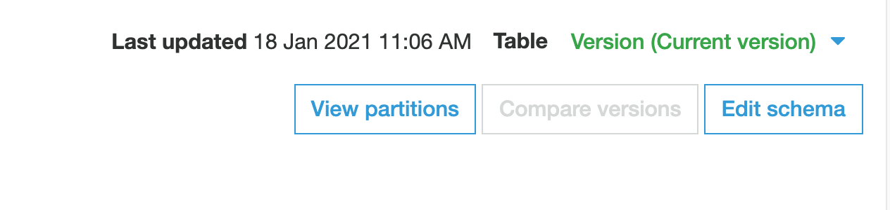

### Glue Crawlers

For Juvare pipeline, the following Glue Crawlers are created:

- devJuvareDailyCDPHIDPHCrawler
- devJuvareDailyHaveBedCrawler

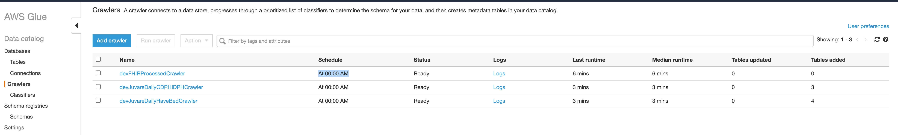

#### How Crawlers work

Glue Crawlers are reponsible to initialy create the Tables with the respective schema from the CSV files gerated previously by the lambdas.

Every time a new file is processed by the Lambdas, it will trigger the respective Glue Crawler so it can get any new partitions(Year, Month, Day) or any changes the the data.

Glue Crawlers can be schedule to run from time to time, in our case, to make sure we are getting always the right partitions and data version, a crawler is executed every day at
At 00:00 AM

To change the schedule, click on the checkbox at right of the Crawler name and click Action > Edit Crawler

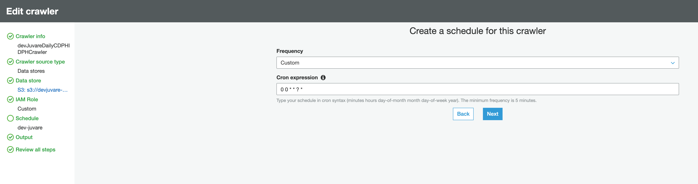

On the left side menu, click on Schedule, and change the Cron expression to one that fits your requirement.

If necessary a crawler can be execute manually, just by selecting the checkbox at the right of the name and click in Run Crawler.

## Athena

After the Crawlers are finished and the new data is parsed into the DataHub Catalog, this data can be queried using SQL like queries in Athena

#### What is Athena and how it works:

Amazon Athena is an interactive query service that makes it easy to analyze data directly in Amazon Simple Storage Service (Amazon S3) using standard SQL. With a few actions in the AWS Management Console, you can point Athena at your data stored in Amazon S3 and begin using standard SQL to run ad-hoc queries and get results in seconds.

Athena is serverless, so there is no infrastructure to set up or manage, and you pay only for the queries you run. Athena scales automatically—running queries in parallel—so results are fast, even with large datasets and complex queries.

For more information [click here for the User Guide Docs](https://docs.aws.amazon.com/athena/latest/ug/what-is.html)

#### Checking data using Athena

After the Crawlers are finished and the new data is parsed into the DataHub Catalog, this data can be queried using SQL like queries in Athena.

To start click on the Blue info message, asking to setup an S3 bucket where the queries will be saved, as showed in the picture below.

Look for a bucket that has athena in the name, this bucket is created automaticaly by CDK.
Add a folder at the end of the S3 URI, to set where the files will be added in the bucket.

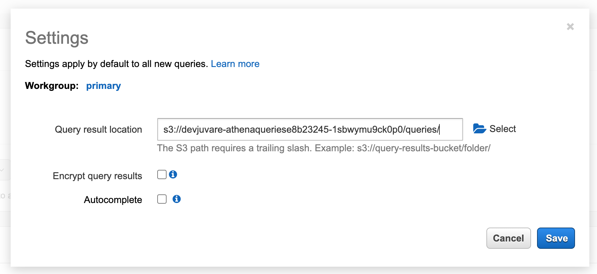

After the S3 bucket is set, click on the Database dropdown to see what databases you have available in your platform, you will probably see 3 databases:

- 1 for the FHIR Datasets, generated by the FHIR converter pipeline;
- 1 for Juvare datasets, generate by the Juvare pipeline
- 1 sample database.

Select the juvare database.
Click in the vertical 3 dots on the side of any table that will show in Tables menu, and click Preview.

This will populate a Query Editor on the right, and execute it automatically, returning the data from that Catalog Database, from that specific table.

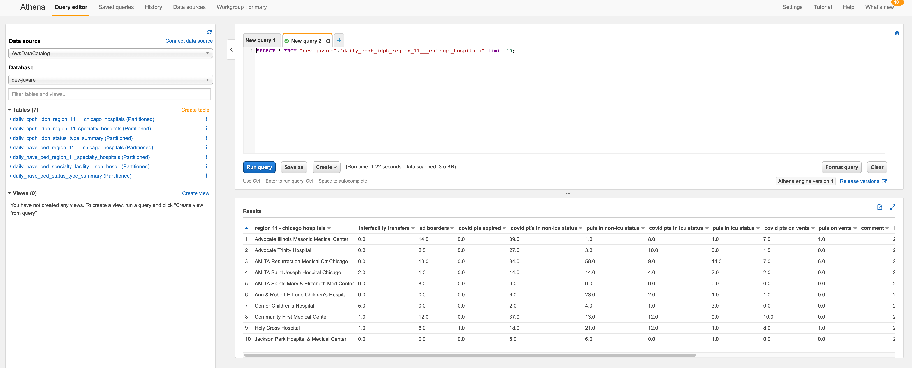

From this point our data is querable and available for consumption into any Analytics platform.

At this point our datasets can be used to generate Reports and Visualizations.
We are going to make use of Quicksight to manipulate the datasets and generate the reports to show Bed Capacity.

## [Quicksight Setup](./Quicksight.md)

[Click HERE to open the Quicksight Setup Instructions](./Quicksight.md)
