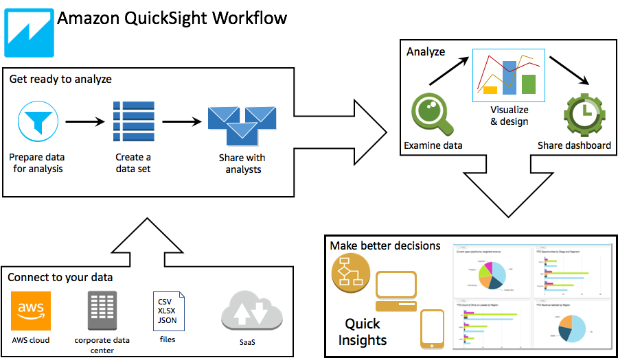
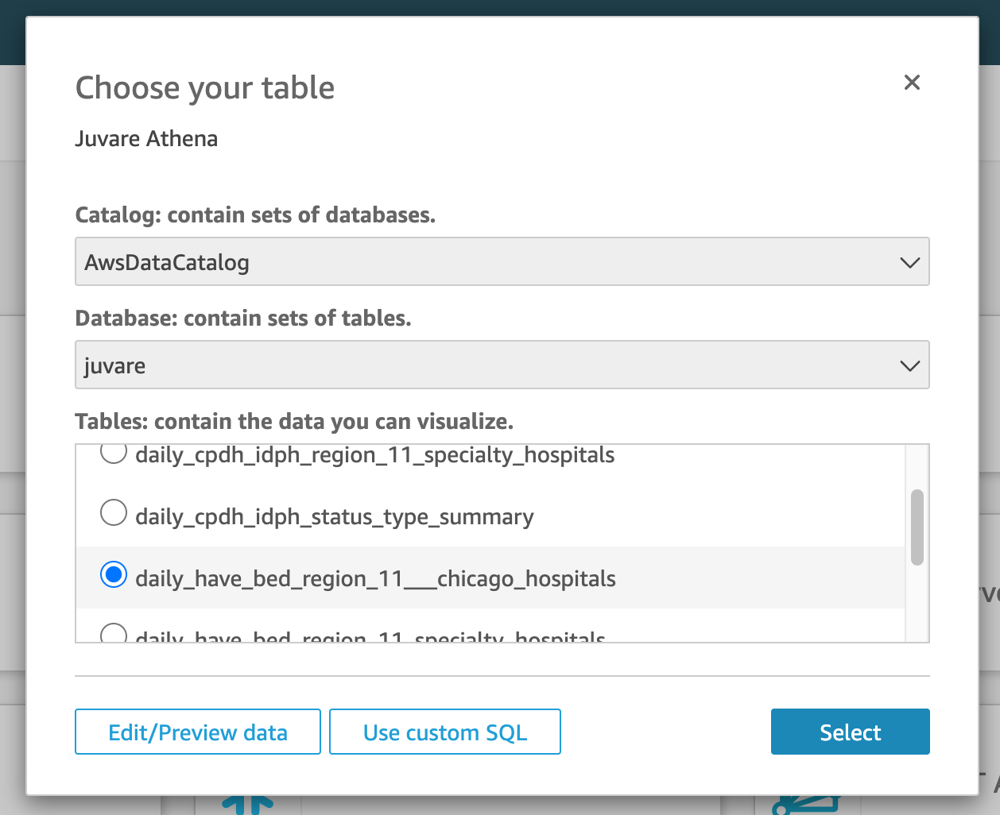

# Quicksight Setup

Requirement: To setup Quicksight for this project, first add some data using the pipeline for [Juvare found here](./Juvare.md).

- [Quicksight Setup](#quicksight-setup)
  - [What is Quicksight](#what-is-quicksight)
  - [How it works:](#how-it-works)
  - [Setup the Quicksight account](#setup-the-quicksight-account)
  - [Add the Datasets](#add-the-datasets)
  - [Join Data Sources](#join-data-sources)
  - [Fix DataTypes](#fix-datatypes)
  - [Add Calculated Fields](#add-calculated-fields)
      - [FileDate - Example](#filedate---example)
      - [Adult ICU Occupied](#adult-icu-occupied)
      - [Bed Availability Adult ICU](#bed-availability-adult-icu)
  - [Add Visualizations](#add-visualizations)
      - [Icu Bed Availability Table](#icu-bed-availability-table)
      - [Icu Bed Availability Bar Chart](#icu-bed-availability-bar-chart)
      - [FileDate Filter](#filedate-filter)
  - [Export the Dashboard](#export-the-dashboard)
  - [Schedule Report](#schedule-report)
  - [Manage Users](#manage-users)

## What is Quicksight

Amazon QuickSight is a cloud-scale business intelligence (BI) service that you can use to deliver easy-to-understand insights to the people who you work with, wherever they are. Amazon QuickSight connects to your data in the cloud and combines data from many different sources. In a single data dashboard, QuickSight can include AWS data, third-party data, big data, spreadsheet data, SaaS data, B2B data, and more. As a fully managed cloud-based service, Amazon QuickSight provides enterprise-grade security, global availability, and built-in redundancy. It also provides the user-management tools that you need to scale from 10 users to 10,000, all with no infrastructure to deploy or manage.

QuickSight gives decision-makers the opportunity to explore and interpret information in an interactive visual environment. They have secure access to dashboards from any device on your network and from mobile devices.

[For more information on Quicksight click HERE](https://docs.aws.amazon.com/quicksight/latest/user/welcome.html)

## How it works:

Using Amazon QuickSight, you can access data and prepare it for use in reporting. It saves your prepared data either in SPICE memory or as a direct query. You can use a variety of data sources for analysis. When you create an analysis, the typical workflow looks like this:

1. Create a new analysis.
2. Add new or existing datasets.
3. Choose fields to create the first chart. QuickSight automatically suggests the best visualization.
4. Add more charts, tables, or insights to the analysis. Resize and rearrange them on one or more sheets. Use extended features to add variables, custom controls, colors, additional pages (called sheets), and more.
5. Publish the analysis as a dashboard to share it with other people.

The following illustration shows the basic workflow.



## Setup the Quicksight account

First step on Quicksight setup is to create an account visiting the Quicksight from the Services menu in the AWS console.

After you choose between Enterprise and Standard plans we can start integrating our data into Quicksight.

## Add the Datasets

For anything in Quicksight, we need a dataset, a dataset can be used from many different sources, from S3, Athena, Redshift, Salesforce, Teradata and many others.

In our case we are going to use Athena, since we already have our data cataloged using Glue.

To start select Datasets on left menu in Quicksight


and Click New Dataset at the Top Right, a new page containing all supported datasets will show up, like below:


Select Athena, a dialog will show up asking to add a Datasource name, it can be anything you like, and the Athena workgroup, should be [primary], if you only have one.


Click Create, and a new Dialog will appear asking to select the Catalog, database and the tables.

If you only have one catalog the catalog will be AwsDataCatalog, and the database is the juvare database created before in Glue steps during Juvare Dataflow implementation.
**Click Edit/Preview data**



After you select the initial table and clicked to preview the data a page similiar to below picture will appear:


At this point we added 1 single table, from the daily have bed, representing the first SpreadSheet from that Excell file processed by Lambda and Glue.
Next we are going to join more data, this time from the CDPH_IDPH table.

## Join Data Sources

To add the extra data we are going to click on the top right button, Add data.


From the dialog that appeared, let's select the daily_cpdh_idpg_region_11\_\_chicago_hospitals


When the new data is select a Join of the data will show up in the Grid, we can click in the pink circles to select where we want to Join and how, like the picture below:


When you are done selecting how you will join the data, click Apply.
The screen will refresh and the Grid will update with the results of the Joining Tables.


At this point let's Save the data so we don't lose any work done so far.
Change the name of the Dataset at the topm, to something more friendly to you and click on the Top Save Button, it will take you back to the Dataset. Click on the Dataset name again, and select Edit, to go back to the Editor.

## Fix DataTypes

Since most of the data converted into the Lambda functions are set as Strings, we need to fix some of the data types that are suppose to be Decimals instead of String.

All the changes done at this stage will only be saved at Quicksight level, the change on datatypes does not change the source data, mantaining your platform working independly of the changes done here.

To fix the Datatypes we are going to change the datatype directly in the column type, click on one of the columns that needs to be Decimals and is String, and change it, please check the picture below.


Perform the same operational for each of the other columns that needs to be change, in the end your columns in the left menu will be looking like the picure below:


## Add Calculated Fields

You can add calculated fields to a dataset during data preparation or from the analysis page. When you add a calculated field to a dataset during data preparation, it's available to all analyses that use that dataset. When you add a calculated field to a dataset in an analysis, it's available only in that analysis. For information about adding calculated fields in an analysis instead, see [Adding a Calculated Field to an Analysis](https://docs.aws.amazon.com/quicksight/latest/user/adding-a-calculated-field-analysis.html).

To start Adding a Calculated Field click on Add Calculated Field on the Top left

#### FileDate - Example

FileDate is a calculated field that will be used as a filter on our data, so we can filter data using a user friendly Calendar widget.

To add this field change the Name of the Field in the Top to FileDate and use the following formula:

```
parseDate(concat({year[daily_have_bed_region_11___chicago_hospitals]}, "-",{month[daily_have_bed_region_11___chicago_hospitals]}, "-", {day[daily_have_bed_region_11___chicago_hospitals]}), "yyyy-MM-dd")
```

Validate if there is no errors at bottom when saving, if your field names are different, please use the Fields DropDown to select the correct field name, like showed in picture below:


After Saved sucessfully a new Field is added to the Calculated Fields Menu on the left at the Editor, and can be viewed in the right most of the Dataset preview in the bottom, as below:


Don't forget to Save when you are done!

#### Adult ICU Occupied

```
{bed capacity: adult icu}-{bed availability: adult icu}
```

Don't forget to Save when you are done!

#### Bed Availability Adult ICU

```
{bed capacity: adult icu}-{Adult ICU Occupied}
```

Don't forget to Save when you are done!

## Add Visualizations

With the Calculated Fields in place is finally time to create the visualizations.

To create a visualization go back to Quicksight home screen and Click on left menu Analyses.

Click on the top right button, New Analysis, and select the Dataset we just added the fields and transformations, and click Create Analysis.

A new window with the dataset select and the fields created will showup, like the picture below:


#### Icu Bed Availability Table

For this first visualization, let's click on the Visual Type Pivot Table, and add the following configuration:

- Rows: select the region 11 - chicago hospitals
- Columns: Empty
- Values: By Columns drag and drop the following:
  - bed capacity: adult icu
  - Adult ICU Occupied
  - Bed Availability Adult ICU
  - Covids pts in ICU Status

Take a look on the pictures below for the example configurations:


#### Icu Bed Availability Bar Chart


#### FileDate Filter

Filter can be added to the dashboard, and can execute the filter along all the charts, tables and tabs at once, please take a look at below filter, that allow the selecion of a single date to perform the selection of the data for that period


## Export the Dashboard

Now that we have our dashboard configure we can publish it, and share it to other users., click on the top right Share menu and start sharing it!


Select the users, emails you want to share with, if you need to add new users click, on Admin, manage users on the left menu


## Schedule Report

You can also send a report by email and schedule this report to be sent automaticaly in a few clicks, select the frequency and the users that you want to send the report and save the scheduler.


## Manage Users

To manage users, click on the Admin icon on the pot right and click on Manage Quicksight.

From that page you can Manage users, subscriptions, account settings, domain, SSO and much more!


