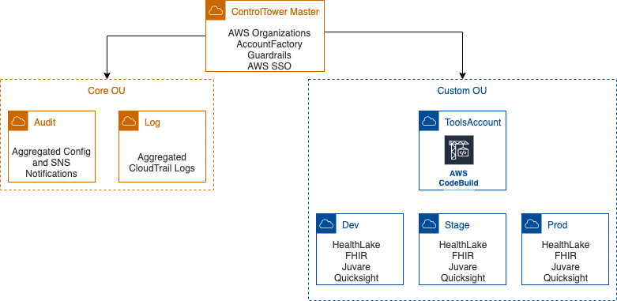

# Rush AWS Account Structure

AWS Accounts in RUSH environment are managed via Control Tower. Below is the current Account structure deployed by AWS ProServe Team

AWS Control Tower creates an abstraction or orchestration layer that combines and integrates the capabilities of several other AWS services, including AWS Organizations, AWS Single Sign-on, and AWS Service Catalog. AWS Control Tower provides the easiest way to set up and govern a secure, compliant, multi-account AWS environment based on best practices established by working with thousands of enterprises.

**Features**

AWS Control Tower has the following features:

**Landing zone** – A landing zone is a well-architected, multi-account AWS environment that's based on security and compliance best practices. It is the enterprise-wide container that holds all of your organizational units (OUs), accounts, users, and other resources that you want to be subject to compliance regulation. A landing zone can scale to fit the needs of an enterprise of any size.

**Guardrails** – A guardrail is a high-level rule that provides ongoing governance for your overall AWS environment. It's expressed in plain language. Two kinds of guardrails exist: preventive and detective. Three categories of guidance apply to the two kinds of guardrails: mandatory, strongly recommended, or elective. For more information about guardrails, see How Guardrails Work.

**Account Factory** – An Account Factory is a configurable account template that helps to standardize the provisioning of new accounts with pre-approved account configurations. AWS Control Tower offers a built-in Account Factory that helps automate the account provisioning workflow in your organization. For more information, see Provision and manage accounts with Account Factory.

**Dashboard** – The dashboard offers continuous oversight of your landing zone to your team of central cloud administrators. Use the dashboard to see provisioned accounts across your enterprise, guardrails enabled for policy enforcement, guardrails enabled for continuous detection of policy non-conformance, and noncompliant resources organized by accounts and OUs.

## Account Descriptions

**AWS SSO Login Page to access all accounts:** https://rushXXXXXXXXXXXx.awsapps.com/start#/

Account details for control tower are redacted

Refer following documentation to understand more about Control Tower and its Administration
https://docs.aws.amazon.com/controltower/latest/userguide/what-is-control-tower.html

As part of this engagement ProServe team has configured Control Tower, created ToolsAccount and Dev01 accounts. Will have Rush deploy Stage and Prod accounts during a walkthrough session.

**Gaurdrails:** Proserve team has enabled Mandatory and most of the Strongly Recommended Gaurdrails. Rush Team can enable/disable any further Elective guardrails as requried.

**Detailed Guardrails reference:**  
https://docs.aws.amazon.com/controltower/latest/userguide/guardrails.html
https://docs.aws.amazon.com/controltower/latest/userguide/guardrails-reference.html

## Security Alerts and Guardrail deviations

Please subscribe to the following SNS Topics in the Audit account to get notified on Security Alerts and Guardrail deviations via Email/SMS

**SNS Topics**

| Name | Arn|
|---|---|
| aws-controltower-AggregateSecurityNotifications | arn:aws:sns:us-east-1:027xyz:aws-controltower-AggregateSecurityNotifications |
| aws-controltower-AllConfigNotifications	|	arn:aws:sns:us-east-1:027ct:xyz:aws-controltower-AllConfigNotifications |
| aws-controltower-SecurityNotifications	|	arn:aws:sns:us-east-1:027ct:xyz:aws-controltower-SecurityNotifications |
