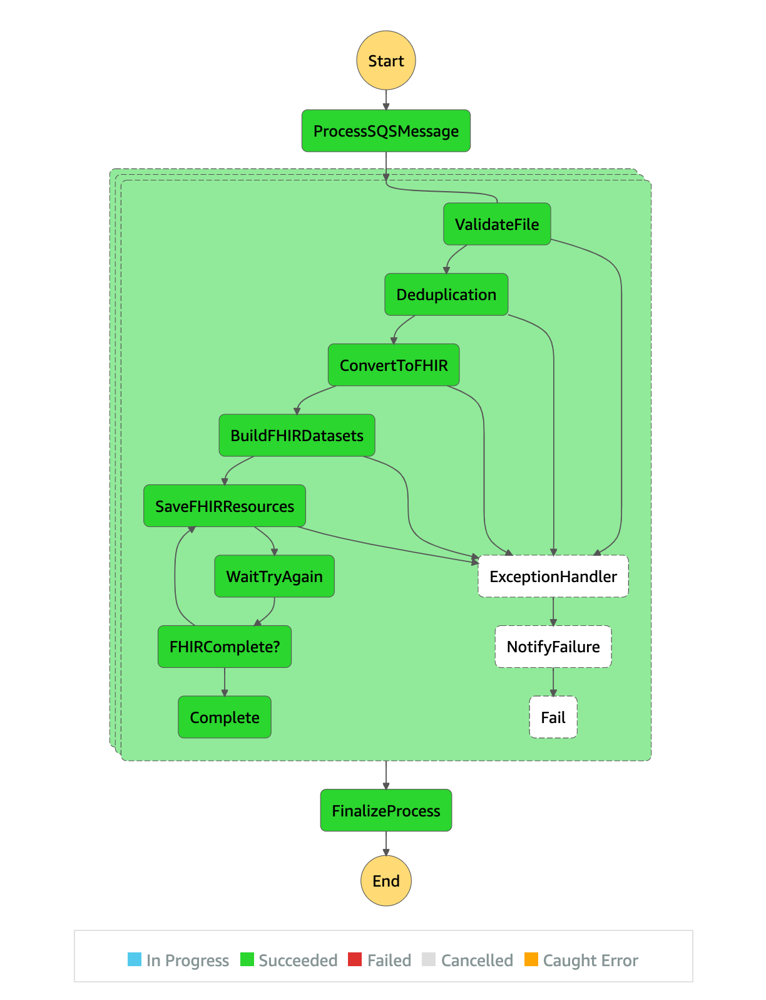

# FHIR convertion and persist to HealthLake

Lambdas responsible for the FHIR Pipeline

#### Step Functions

AWS Step Functions lets you add resilient workflow automation to your applications in minutes—without writing code. Workflows built with Step Functions include built-in error handling, parameter passing, recommended security settings, and state management, reducing the amount of code you have to write and maintain.

All functions for the FHIR Pipeline are executed using a step machine defined using [Step Functions](https://aws.amazon.com/step-functions/getting-started/).

Bellow is each step definition and documentation.

- Step 0: [Start the State Machine](./ccda_step0_start_state_machine)
- Step 1: [List the Files](./ccda_step1_new_files)
- Step 2: [Validate each File](./ccda_step2_validation)
- Step 3: [De-duplication](./ccda_step3_deduplication)
- Step 4: [Convert toi FHIR Bundle](./ccda_step4_converter)
- Step 5: [Build the Datasets](./ccda_step5_dataset_builder)
- Step 6: [Save to HealthLake](./ccda_step6_fhir_resource_split)
- Exception Handler: [Handling Exceptions](./ccda_exception_handler)
- Finish Execution: [Finish](./ccda_finish_stepfunction)

### Extra Settings

@TODO

### Reprocessing

@TODO

### Debugging

@TODO

## Juvare parser and Glue update

@TODO
