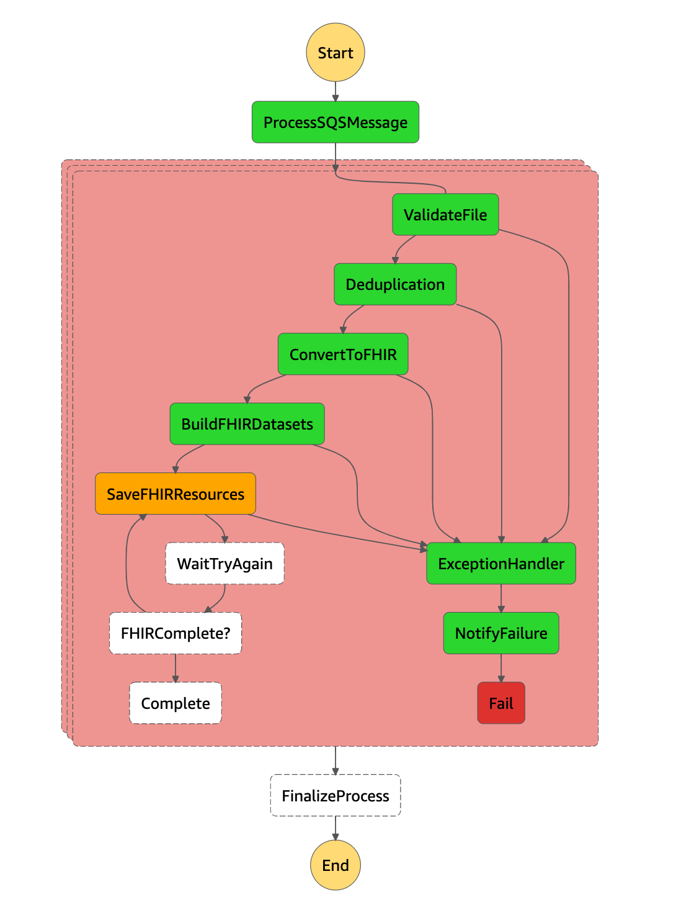

### Exception Handler

Lambda responsible to handle the exceptions.

Everytime an execution raise an Exception, it will end at the Fail Step, and a new iteration starts.
The Exception is Catch by the Exception handler, who performs the process needed and send the error to an SNS Topic.



From the SNS Topic, you can subscribe several services to it, or simple executions like send the error to an monitoring email address.

Please see below how to configure the SNS subscriber

### SNS Notification subscriber configuration

#### State input sample:

```json
{
  "Error": "FhirDatasetsGenerationError",
  "Cause": {"errorMessage":{"error": "'display'", "event": {"Source": {"sqs_message_id": "605cb09a-1c8f-46fb-80b0-5a83ecd3577d", "aws_request_id": "7c8a6d61-7376-5aaf-baa6-3513e4c174ac"}, "Object": {"bucket": "devdatastack-landingapiaae66c3d-1vj0vorkfuba9", "key": "e107a826-d192-47d4-94c8-4d97c868e583.xml", "Type": "HL7", "md5_digest": "c911ce47ce003fa62631f7ce9acaf9e9"}, "Status": "CONVERTED", "Fhir": {"bucket": "devdatastack-processedeabdebfd-m9jgldc6h55v", "key": "converted/year=2021/month=1/day=8/message_id=605cb09a-1c8f-46fb-80b0-5a83ecd3577d/e107a826-d192-47d4-94c8-4d97c868e583.xml.fhir.json"}}},"errorType":"FhirDatasetsGenerationError","stackTrace":["  File "/var/task/lambda_function.py", line 99, in lambda_handlern    if generate_datasets(fhir_content, f_name, sqs_message_id, event):n","  File "/var/task/lambda_function.py", line 81, in generate_datasetsn    raise FhirDatasetsGenerationError(event, str(err))n"]}
}
```

#### State output sample:

```json
{
  "Message": "'display'",
  "Exception": "FhirDatasetsGenerationError",
  "Timestamp": 1610126733,
  "Source": {
    "sqs_message_id": "605cb09a-1c8f-46fb-80b0-5a83ecd3577d",
    "aws_request_id": "7c8a6d61-7376-5aaf-baa6-3513e4c174ac"
  },
  "Object": {
    "bucket": "devdatastack-landingapiaae66c3d-1vj0vorkfuba9",
    "key": "e107a826-d192-47d4-94c8-4d97c868e583.xml",
    "Type": "HL7",
    "md5_digest": "c911ce47ce003fa62631f7ce9acaf9e9"
  },
  "Status": "EXCEPTION",
  "IsDupHashDeleted": true
}
```
