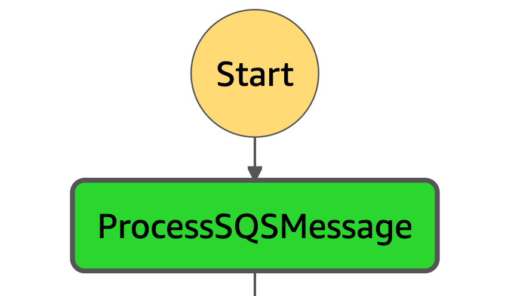

# Step 1 - New Files

#### lambda_function.py

Lambda Handler that executes Step 1 of the Pipeline.

Check if there is a 'Records' key in the event and for each Record check the type of file by the filetype.

If the file is in the compress list:
**@TODO**: - open the compressed list locally, copy each file to the Raw folder - Add each Record to the list of Records

If not int the compress list, add the record to the list.



#### State input sample:

```
{
  "aws_request_id": "302107e8-f3f4-5e08-90f2-5f9a4b8a936d",
  "Records": [
    {
      "Source": {
        "sqs_message_id": "bfe78a99-a6d5-45c9-a0d5-7e9283889bf9",
        "receiptHandle": "AQEBhbG/A1BdKrDR9IdcjKCglXELZ4H5AlEIKxMRm+b3auWL9izpswMgNWK/A6cB26yiJ+28UQgxYj7XriO09gZVOYC/ZVwzY8WaO2GJ1uvHJzu/m0uzIVF/O4WgIWyeUOwZgtYl5Y0gh9XHc+v1WeqeapvGVhsJ5sTiFDfNdkDNFO37mN9weOc0Ii6hJSQtw6pG5NBwj1kVpKUHvhckfu+GX47YHvzdUruStijQNdB7JKfLyrmiMX5FvBf0O8j08072kT9yYD2UkYF5zCu3H1qxxSosFqlOcUK8hN+XIRP5KB3xn11BNL89RI+46VlYqKbV+SabR4YUdrL4MyWztsiPo05qqAGW+oodRhb1g2uCFEmsuz8rImYzFDGZlbvheGNA3yRSEM0Jq993xRrBZdnMsagMYMtMA+wxTBWdDkDOsSI="
      },
      "Record": {
        "eventVersion": "2.1",
        "eventSource": "aws:s3",
        "awsRegion": "us-east-1",
        "eventTime": "2021-01-08T19:45:07.463Z",
        "eventName": "ObjectCreated:Put",
        "userIdentity": {
          "principalId": "AWS:AROA6AFCJYENOVT63BBVM:dccanive-Isengard"
        },
        "requestParameters": {
          "sourceIPAddress": "10.0.0.1"
        },
        "responseElements": {
          "x-amz-request-id": "FBE9722A9B296E2F",
          "x-amz-id-2": "MbDJ+kV74UYHa/SOYvZshei9MV6blkH/BtrkOmFawirO2rYj3mcT4ksZMW6/RCgbeh1fRNA0pZp9ihnSxh443DpOwSi6vgUZ"
        },
        "s3": {
          "s3SchemaVersion": "1.0",
          "configurationId": "YzlhMTZiOTgtYzRlYS00NzM1LTlmY2ItNDExNmI2MDk1OWMw",
          "bucket": {
            "name": "devdatastack-landingdirectcad59385-16lw97bb7fhkp",
            "ownerIdentity": {
              "principalId": "99999999999"
            },
            "arn": "arn:aws:s3:::devdatastack-landingdirectcad59385-16lw97bb7fhkp"
          },
          "object": {
            "key": "0ffd6412-554f-c218-0211-3a912f683b5e.xml",
            "size": 331972,
            "eTag": "d8e6686a6056a89df5096350967f6828",
            "versionId": "QxIwSWYlj2O2MtuABq8jwaJbO096kPGN",
            "sequencer": "005FF8B643CCF73F5F"
          }
        }
      }
    }
  ]
}
```

#### State output sample:

```
{
  "Records": [
    {
      "Source": {
        "sqs_message_id": "bfe78a99-a6d5-45c9-a0d5-7e9283889bf9",
        "aws_request_id": "302107e8-f3f4-5e08-90f2-5f9a4b8a936d",
        "receiptHandle": "AQEBhbG/A1BdKrDR9IdcjKCglXELZ4H5AlEIKxMRm+b3auWL9izpswMgNWK/A6cB26yiJ+28UQgxYj7XriO09gZVOYC/ZVwzY8WaO2GJ1uvHJzu/m0uzIVF/O4WgIWyeUOwZgtYl5Y0gh9XHc+v1WeqeapvGVhsJ5sTiFDfNdkDNFO37mN9weOc0Ii6hJSQtw6pG5NBwj1kVpKUHvhckfu+GX47YHvzdUruStijQNdB7JKfLyrmiMX5FvBf0O8j08072kT9yYD2UkYF5zCu3H1qxxSosFqlOcUK8hN+XIRP5KB3xn11BNL89RI+46VlYqKbV+SabR4YUdrL4MyWztsiPo05qqAGW+oodRhb1g2uCFEmsuz8rImYzFDGZlbvheGNA3yRSEM0Jq993xRrBZdnMsagMYMtMA+wxTBWdDkDOsSI="
      },
      "Object": {
        "bucket": "devdatastack-landingdirectcad59385-16lw97bb7fhkp",
        "key": "0ffd6412-554f-c218-0211-3a912f683b5e.xml"
      },
      "Status": "SINGLE_FILE"
    }
  ]
}
```
