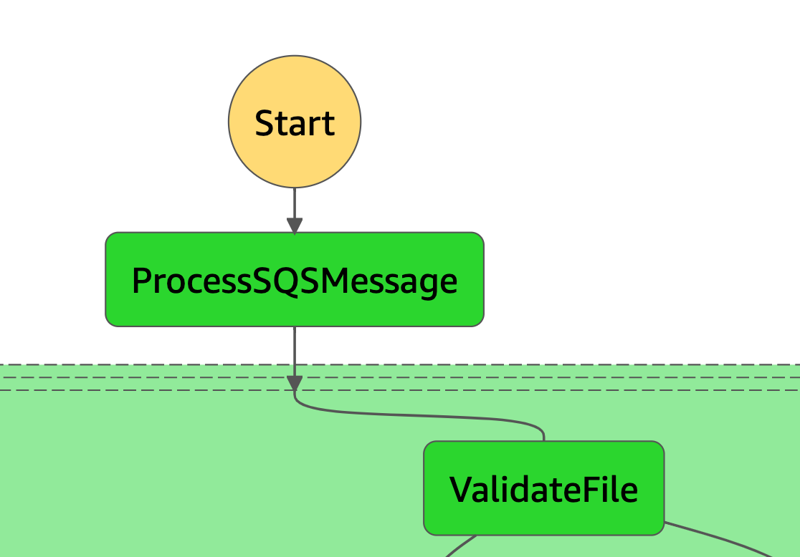

# Step 2 - Validate File types

#### lambda_function.py

Lambda Handler that validates what type of file needs to be processed: CCD or HL7 are acceptable file types.

Add the file type to the output results or return an Exception of Unsuported file.



#### State input sample:

```
{
  "Source": {
    "sqs_message_id": "bfe78a99-a6d5-45c9-a0d5-7e9283889bf9",
    "aws_request_id": "302107e8-f3f4-5e08-90f2-5f9a4b8a936d",
    "receiptHandle": "AQEBhbG/A1BdKrDR9IdcjKCglXELZ4H5AlEIKxMRm+b3auWL9izpswMgNWK/A6cB26yiJ+28UQgxYj7XriO09gZVOYC/ZVwzY8WaO2GJ1uvHJzu/m0uzIVF/O4WgIWyeUOwZgtYl5Y0gh9XHc+v1WeqeapvGVhsJ5sTiFDfNdkDNFO37mN9weOc0Ii6hJSQtw6pG5NBwj1kVpKUHvhckfu+GX47YHvzdUruStijQNdB7JKfLyrmiMX5FvBf0O8j08072kT9yYD2UkYF5zCu3H1qxxSosFqlOcUK8hN+XIRP5KB3xn11BNL89RI+46VlYqKbV+SabR4YUdrL4MyWztsiPo05qqAGW+oodRhb1g2uCFEmsuz8rImYzFDGZlbvheGNA3yRSEM0Jq993xRrBZdnMsagMYMtMA+wxTBWdDkDOsSI="
  },
  "Object": {
    "bucket": "devdatastack-landingdirectcad59385-16lw97bb7fhkp",
    "key": "0ffd6412-554f-c218-0211-3a912f683b5e.xml"
  },
  "Status": "SINGLE_FILE"
}
```

#### State output sample:

```
{
  "Source": {
    "sqs_message_id": "bfe78a99-a6d5-45c9-a0d5-7e9283889bf9",
    "aws_request_id": "302107e8-f3f4-5e08-90f2-5f9a4b8a936d",
    "receiptHandle": "AQEBhbG/A1BdKrDR9IdcjKCglXELZ4H5AlEIKxMRm+b3auWL9izpswMgNWK/A6cB26yiJ+28UQgxYj7XriO09gZVOYC/ZVwzY8WaO2GJ1uvHJzu/m0uzIVF/O4WgIWyeUOwZgtYl5Y0gh9XHc+v1WeqeapvGVhsJ5sTiFDfNdkDNFO37mN9weOc0Ii6hJSQtw6pG5NBwj1kVpKUHvhckfu+GX47YHvzdUruStijQNdB7JKfLyrmiMX5FvBf0O8j08072kT9yYD2UkYF5zCu3H1qxxSosFqlOcUK8hN+XIRP5KB3xn11BNL89RI+46VlYqKbV+SabR4YUdrL4MyWztsiPo05qqAGW+oodRhb1g2uCFEmsuz8rImYzFDGZlbvheGNA3yRSEM0Jq993xRrBZdnMsagMYMtMA+wxTBWdDkDOsSI="
  },
  "Object": {
    "bucket": "devdatastack-landingdirectcad59385-16lw97bb7fhkp",
    "key": "0ffd6412-554f-c218-0211-3a912f683b5e.xml",
    "Type": "CCD"
  },
  "Status": "VALID"
}
```
