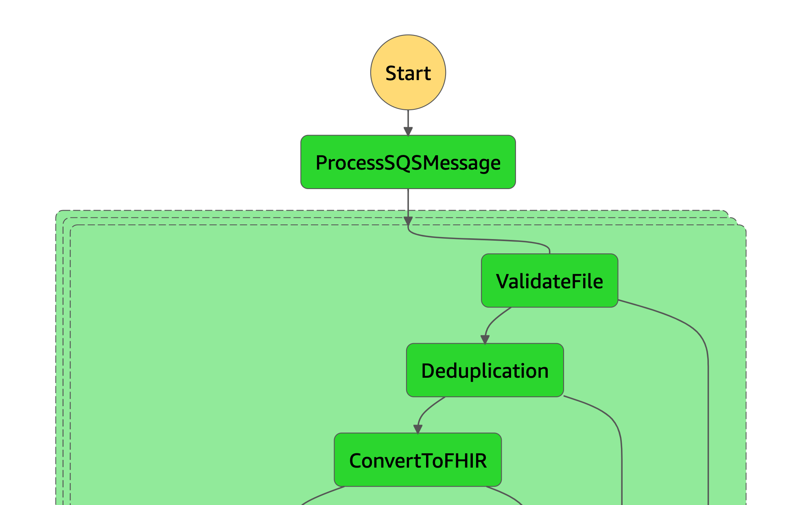

# Step 4 - Convert CCD or ADT to FHIR Bundle

#### lambda_function.py

Lambda Handler that executes Step 4 of the Pipeline, convert the raw CCD or HL7 file into FHIR Bundle.

This step send a Post request with the content of the CCD or the HL7 to the ECS Cluster Endpoint.
The response is a FHIR Bundle type Batch, that is saved in S3 and forward to the Dataset Generator.

#### Enviroment Variables

| Enviroment Variable             | Description                                       |
| ------------------------------- | ------------------------------------------------- |
| CCDS_SQSMESSAGE_TABLE_LOG       | Table in DynamoDB where the logs are saved        |
| BUCKET_PROCESSED_CCDS           | Bucket where processed CCD and HL7 are saved      |
| CCD_FHIR_CONVERTER_ENDPOINT     | URL parameters for the FHIR endpoint convert CCDs |
| CCD_FHIR_CONVERTER_TEMPLATENAME | Template Name used to perform the CCDs conversion |
| FHIR_CONVERTER_URL              | Endpoint URL for the FHIR Converter               |
| FOLDER_PROCESSED_CCDS           | Folder where processed CCDs/HL7s are saved        |
| HL7_FHIR_CONVERTER_ENDPOINT     | URL parameters for the FHIR endpoint convert HL7  |
| HL7_FHIR_CONVERTER_TEMPLATENAME | Template Name used to perform the HL7 conversion  |

#### Exceptions

@TODO



#### State input sample:

```
{{
  "Source": {
    "sqs_message_id": "bfe78a99-a6d5-45c9-a0d5-7e9283889bf9",
    "aws_request_id": "302107e8-f3f4-5e08-90f2-5f9a4b8a936d",
    "receiptHandle": "AQEBhbG/A1BdKrDR9IdcjKCglXELZ4H5AlEIKxMRm+b3auWL9izpswMgNWK/A6cB26yiJ+28UQgxYj7XriO09gZVOYC/ZVwzY8WaO2GJ1uvHJzu/m0uzIVF/O4WgIWyeUOwZgtYl5Y0gh9XHc+v1WeqeapvGVhsJ5sTiFDfNdkDNFO37mN9weOc0Ii6hJSQtw6pG5NBwj1kVpKUHvhckfu+GX47YHvzdUruStijQNdB7JKfLyrmiMX5FvBf0O8j08072kT9yYD2UkYF5zCu3H1qxxSosFqlOcUK8hN+XIRP5KB3xn11BNL89RI+46VlYqKbV+SabR4YUdrL4MyWztsiPo05qqAGW+oodRhb1g2uCFEmsuz8rImYzFDGZlbvheGNA3yRSEM0Jq993xRrBZdnMsagMYMtMA+wxTBWdDkDOsSI="
  },
  "Object": {
    "bucket": "devdatastack-landingdirectcad59385-16lw97bb7fhkp",
    "key": "0ffd6412-554f-c218-0211-3a912f683b5e.xml",
    "Type": "CCD",
    "md5_digest": "69aacbfef722f78fddb59aadfc3a036f"
  },
  "Status": "VALID"
}
```

#### State output sample:

```
{
  "Source": {
    "sqs_message_id": "bfe78a99-a6d5-45c9-a0d5-7e9283889bf9",
    "aws_request_id": "302107e8-f3f4-5e08-90f2-5f9a4b8a936d",
    "receiptHandle": "AQEBhbG/A1BdKrDR9IdcjKCglXELZ4H5AlEIKxMRm+b3auWL9izpswMgNWK/A6cB26yiJ+28UQgxYj7XriO09gZVOYC/ZVwzY8WaO2GJ1uvHJzu/m0uzIVF/O4WgIWyeUOwZgtYl5Y0gh9XHc+v1WeqeapvGVhsJ5sTiFDfNdkDNFO37mN9weOc0Ii6hJSQtw6pG5NBwj1kVpKUHvhckfu+GX47YHvzdUruStijQNdB7JKfLyrmiMX5FvBf0O8j08072kT9yYD2UkYF5zCu3H1qxxSosFqlOcUK8hN+XIRP5KB3xn11BNL89RI+46VlYqKbV+SabR4YUdrL4MyWztsiPo05qqAGW+oodRhb1g2uCFEmsuz8rImYzFDGZlbvheGNA3yRSEM0Jq993xRrBZdnMsagMYMtMA+wxTBWdDkDOsSI="
  },
  "Object": {
    "bucket": "devdatastack-landingdirectcad59385-16lw97bb7fhkp",
    "key": "0ffd6412-554f-c218-0211-3a912f683b5e.xml",
    "Type": "CCD",
    "md5_digest": "69aacbfef722f78fddb59aadfc3a036f"
  },
  "Status": "CONVERTED",
  "Fhir": {
    "bucket": "devdatastack-processedeabdebfd-m9jgldc6h55v",
    "key": "converted/year=2021/month=1/day=8/message_id=bfe78a99-a6d5-45c9-a0d5-7e9283889bf9/0ffd6412-554f-c218-0211-3a912f683b5e.xml.fhir.json"
  }
}
```
